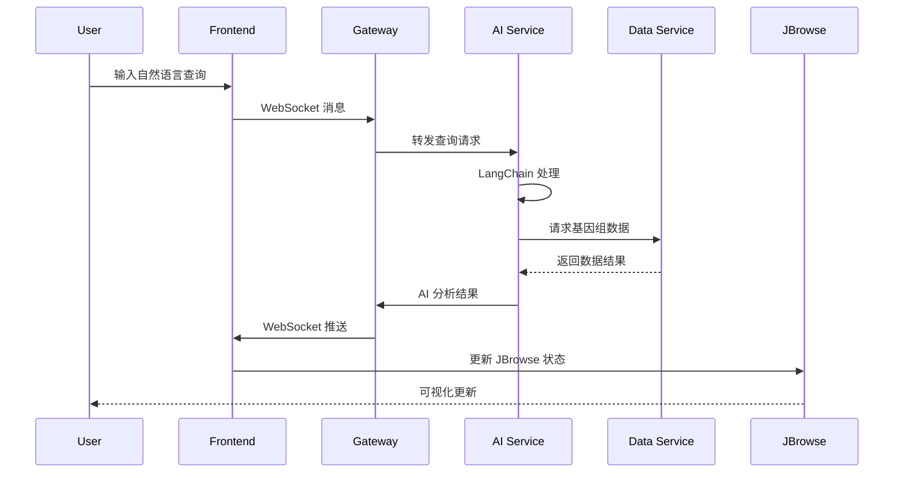

# AI 基因组分析助手设计文档

## 概述

本项目将在现有的 JBrowse 2
React 应用基础上，构建一个前后端分离的智能基因组分析系统。前端保持现有的 JBrowse
2 可视化能力，并添加 AI 对话界面；后端提供 AI 服务、数据处理和知识库查询功能。

## 系统架构

### 整体架构图

```mermaid
graph TB
    subgraph "前端层 (Frontend)"
        A[JBrowse 2 React App] --> B[AI Chat Interface]
        A --> C[Visualization Controller]
        B --> D[WebSocket Client]
        C --> E[JBrowse State Manager]
    end

    subgraph "API 网关层"
        F[API Gateway / Load Balancer]
    end

    subgraph "后端服务层 (Backend Services)"
        G[AI Service] --> H[LangChain Orchestrator]
        I[Data Service] --> J[Genomics Data Processor]
        K[Knowledge Service] --> L[External DB Connectors]
        M[Session Service] --> N[Context Manager]
    end

    subgraph "AI 模型层"
        O[OpenAI Compatible API]
        P[Local Models (Optional)]
        Q[Specialized Genomics Models]
    end

    subgraph "数据存储层"
        R[(Session Store)]
        S[(Knowledge Cache)]
        T[(User Data)]
        U[External Genomics DBs]
    end

    D --> F
    F --> G
    F --> I
    F --> K
    F --> M

    H --> O
    H --> P
    H --> Q

    J --> T
    L --> U
    N --> R
    K --> S
```

## 核心组件设计

### 1. 前端架构 (React + TypeScript)

#### 1.1 现有 JBrowse 2 集成

- **保持现有结构**：继续使用 `@jbrowse/react-app2` 作为核心可视化组件
- **状态管理增强**：扩展 JBrowse 的 `viewState` 以支持 AI 交互
- **组件扩展**：在现有 App.tsx 基础上添加 AI 功能模块

#### 1.2 新增 AI 交互组件

```typescript
// 组件结构
src/
├── components/
│   ├── ai/
│   │   ├── ChatInterface.tsx          // 主对话界面
│   │   ├── MessageBubble.tsx          // 消息气泡组件
│   │   ├── QuerySuggestions.tsx       // 查询建议
│   │   └── AnalysisResults.tsx        // 分析结果展示
│   ├── jbrowse/
│   │   ├── EnhancedJBrowseApp.tsx     // 增强的 JBrowse 组件
│   │   └── AIControlledTracks.tsx     // AI 控制的轨道组件
│   └── layout/
│       ├── SplitLayout.tsx            // 分屏布局
│       └── ResizablePanels.tsx        // 可调整面板
├── services/
│   ├── aiService.ts                   // AI 服务客户端
│   ├── websocketService.ts            // WebSocket 连接管理
│   └── jbrowseController.ts           // JBrowse 控制器
├── hooks/
│   ├── useAIChat.ts                   // AI 对话钩子
│   ├── useJBrowseState.ts             // JBrowse 状态钩子
│   └── useGenomicsData.ts             // 基因组数据钩子
└── types/
    ├── ai.types.ts                    // AI 相关类型定义
    └── genomics.types.ts              // 基因组数据类型
```

#### 1.3 状态管理策略

- **Context API**：管理 AI 对话状态和用户偏好
- **JBrowse State**：继续使用 JBrowse 的内置状态管理
- **WebSocket State**：实时同步 AI 分析结果

### 2. 后端架构 (Node.js + Express/FastAPI)

#### 2.1 微服务架构

```
backend/
├── services/
│   ├── ai-service/                    // AI 核心服务
│   │   ├── src/
│   │   │   ├── controllers/
│   │   │   │   ├── chatController.ts
│   │   │   │   └── analysisController.ts
│   │   │   ├── services/
│   │   │   │   ├── langchainService.ts
│   │   │   │   ├── promptService.ts
│   │   │   │   └── modelService.ts
│   │   │   └── utils/
│   │   │       ├── genomicsParser.ts
│   │   │       └── responseFormatter.ts
│   │   └── package.json
│   ├── data-service/                  // 数据处理服务
│   │   ├── src/
│   │   │   ├── controllers/
│   │   │   │   └── genomicsController.ts
│   │   │   ├── services/
│   │   │   │   ├── dataProcessor.ts
│   │   │   │   └── fileHandler.ts
│   │   │   └── adapters/
│   │   │       ├── vcfAdapter.ts
│   │   │       ├── bamAdapter.ts
│   │   │       └── gffAdapter.ts
│   │   └── package.json
│   ├── knowledge-service/             // 知识库服务
│   │   ├── src/
│   │   │   ├── controllers/
│   │   │   │   └── knowledgeController.ts
│   │   │   ├── services/
│   │   │   │   ├── ensemblService.ts
│   │   │   │   ├── clinvarService.ts
│   │   │   │   └── pubmedService.ts
│   │   │   └── cache/
│   │   │       └── redisCache.ts
│   │   └── package.json
│   └── session-service/               // 会话管理服务
│       ├── src/
│       │   ├── controllers/
│       │   │   └── sessionController.ts
│       │   ├── services/
│       │   │   ├── contextManager.ts
│       │   │   └── historyService.ts
│       │   └── models/
│       │       └── sessionModel.ts
│       └── package.json
├── gateway/                           // API 网关
│   ├── src/
│   │   ├── routes/
│   │   ├── middleware/
│   │   └── proxy/
│   └── package.json
└── shared/                           // 共享库
    ├── types/
    ├── utils/
    └── constants/
```

#### 2.2 AI 服务核心设计

```typescript
// LangChain 集成架构
class AIOrchestrator {
  private llm: BaseLLM
  private vectorStore: VectorStore
  private genomicsTools: Tool[]

  constructor(config: AIConfig) {
    // 支持多种 OpenAI 兼容接口
    this.llm = new ChatOpenAI({
      openAIApiKey: config.apiKey,
      openAIApiBase: config.baseUrl, // 支持自定义端点
      modelName: config.modelName,
    })

    this.setupGenomicsTools()
    this.initializeVectorStore()
  }

  async processQuery(
    query: string,
    context: GenomicsContext,
  ): Promise<AIResponse> {
    const agent = new ReActAgent({
      llm: this.llm,
      tools: this.genomicsTools,
      memory: new ConversationBufferMemory(),
    })

    return await agent.run({
      input: query,
      genomicsContext: context,
    })
  }
}

// 基因组学专用工具
const genomicsTools = [
  new GeneSearchTool(),
  new VariantAnalysisTool(),
  new RegionNavigationTool(),
  new TrackControlTool(),
  new SequenceAnalysisTool(),
]
```

### 3. 数据流设计

#### 3.1 实时通信架构



#### 3.2 数据处理管道

```typescript
interface DataPipeline {
  // 输入处理
  parseNaturalLanguage(query: string): ParsedQuery

  // 数据获取
  fetchGenomicsData(params: QueryParams): Promise<GenomicsData>

  // AI 分析
  analyzeWithAI(data: GenomicsData, context: string): Promise<Analysis>

  // 结果格式化
  formatForVisualization(analysis: Analysis): JBrowseConfig

  // 状态同步
  syncWithJBrowse(config: JBrowseConfig): void
}
```

## 接口设计

### 1. WebSocket API

```typescript
// 客户端到服务器
interface ClientMessage {
  type: 'query' | 'follow_up' | 'control'
  sessionId: string
  content: string
  context?: GenomicsContext
}

// 服务器到客户端
interface ServerMessage {
  type: 'response' | 'analysis' | 'visualization' | 'error'
  sessionId: string
  data: any
  metadata?: MessageMetadata
}
```

### 2. REST API

```typescript
// AI 服务接口
POST /api/ai/chat
POST /api/ai/analyze
GET  /api/ai/suggestions

// 数据服务接口
GET  /api/data/gene/:geneId
POST /api/data/region
GET  /api/data/variants

// 知识库接口
GET  /api/knowledge/gene/:symbol
GET  /api/knowledge/variant/:variantId
POST /api/knowledge/search

// 会话管理接口
POST /api/session/create
GET  /api/session/:sessionId
PUT  /api/session/:sessionId
DELETE /api/session/:sessionId
```

## 错误处理策略

### 1. 前端错误处理

- **网络错误**：自动重连机制，降级到离线模式
- **AI 响应错误**：显示友好错误信息，提供重试选项
- **数据加载错误**：部分加载失败时保持其他功能可用

### 2. 后端错误处理

- **模型服务异常**：自动切换到备用模型
- **数据源不可用**：使用缓存数据或替代数据源
- **并发限制**：请求队列和限流机制

## 测试策略

### 1. 前端测试

- **单元测试**：React 组件和工具函数
- **集成测试**：AI 对话流程和 JBrowse 集成
- **E2E 测试**：完整的用户交互场景

### 2. 后端测试

- **API 测试**：所有 REST 和 WebSocket 接口
- **AI 服务测试**：模拟不同的查询场景
- **性能测试**：并发处理和响应时间

## 部署架构

### 1. 容器化部署

```yaml
# docker-compose.yml
version: '3.8'
services:
  frontend:
    build: ./frontend
    ports:
      - '3000:3000'

  gateway:
    build: ./backend/gateway
    ports:
      - '8000:8000'

  ai-service:
    build: ./backend/services/ai-service
    environment:
      - OPENAI_API_KEY=${OPENAI_API_KEY}
      - OPENAI_BASE_URL=${OPENAI_BASE_URL}

  data-service:
    build: ./backend/services/data-service

  knowledge-service:
    build: ./backend/services/knowledge-service

  redis:
    image: redis:alpine

  postgres:
    image: postgres:14
```

### 2. 扩展性考虑

- **水平扩展**：微服务架构支持独立扩展
- **负载均衡**：API 网关层实现请求分发
- **缓存策略**：Redis 缓存热点数据和会话信息
- **CDN 集成**：静态资源和大文件分发优化
